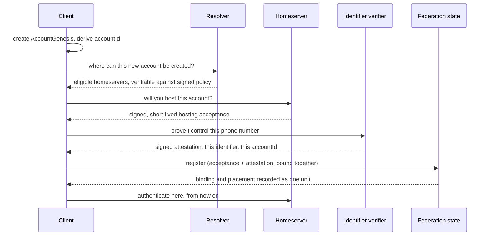
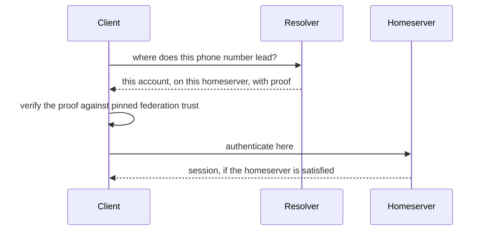

# Gua identity and federation: how accounts find their home

> **Status: TARGET ARCHITECTURE, governed by [ADM-001](../decisions/ADM-001-identifier-binding-placement-trust.md).**
> This guide explains the design in plain terms. Where it describes something that is not built yet, it says so. The section [What exists today](#what-exists-today) is the authoritative line between the two.

This document is for a product stakeholder or a newly hired engineer. It teaches the concepts in the order they depend on each other, and it keeps cryptographic mechanism out of the main story. When you need the mechanism, follow the links.

---

## The one idea to hold onto

Gua is not one server. It is a **federation of many trusted homeservers**, each operated independently, each holding the accounts, rooms and message history of its own users. A person on one homeserver talks to a person on another without either of them knowing or caring which is which.

That raises four questions that sound similar and are not. Keeping them apart is most of what this architecture is.

### 1. Allocation: "Where should this new account be created?"

Someone signs up. They have no account anywhere yet. Some homeserver has to be chosen to hold the new account, based on rules the federation agrees on: which homeservers are accepting new users, their capacity, the person's region, an organisation they belong to.

Allocation is a **proposal**. It says "this is an eligible place to create the account". It commits nothing until the account is actually created.

### 2. Placement: "Where does this existing account already live?"

Once an account exists, it lives on exactly one homeserver. Placement is the **committed fact** of where. It changes only through an explicit migration, never because a routing rule was edited.

The difference between allocation and placement is the difference between a proposal and a record. A routing rule can change where *new* accounts go. It can never silently move an *existing* one.

### 3. Binding: "Which stable account does this identifier refer to?"

A phone number, an email address, or a login from an organisation's sign-on system is a **globally routable identifier**: something a person can type on a new device that should lead them back to their own account.

A binding is the record that says "this identifier refers to that account". It is an **attribute of the account, not the account itself**. When a carrier reassigns a phone number to a new person, the binding moves. The account, its history, its credentials and its placement do not.

### 4. Authentication: "Is this person allowed into that account right now?"

Everything above is about *finding* an account. Authentication is about *getting in*. It is the homeserver checking a passkey, a PIN, a one-time code, or an organisation's sign-on, and deciding whether to open the door.

**This is the line the whole design is built around:**

> The **federation** coordinates binding and placement.
> The **target homeserver** owns authentication.
> The **resolver** serves and verifies routing information. It does not authenticate anyone.

An artifact that proves you own a phone number is never a key that opens an account. Owning the identifier gets you *to* the right homeserver. The homeserver then decides whether to let you in.

---

## The pieces

| Component | Role in the story |
|---|---|
| **Homeserver** | Holds accounts, rooms, messages and keys for its users. Owns authentication for them. One of many. |
| **Resolver** | The front door before login. Answers "where does this identifier lead?" by serving verifiable routing information. Anyone can run one. Running one grants no authority. |
| **Federation governance** | The small set of parties whose keys define who is a member, which verifiers are accredited, and what the routing rules are. Signs records; does not run logins. |
| **Identifier verifier** | Checks that a person really controls a phone number, email or organisation identity, and signs a statement saying so. Accredited by governance. Several may exist. |
| **Client** | The Gua app. Asks the resolver, verifies what it is told, connects to the right homeserver, and does its authentication there. |

---

## A stable account identity

Once the four questions are clear, one more concept is needed: an account has to have a name that does not change when any of the above changes.

Every Gua account begins with an **`AccountGenesis`**: a small, immutable object created on the person's own device at signup. It records the account's initial authority key, the framework for how the account can be recovered, and the algorithms in use. Its cryptographic fingerprint is the **`accountId`**.

Two things are deliberately **not** in it: any identifier, and any homeserver. The phone number is a binding that can change. The homeserver is a placement that can change. The `accountId` is the one thing that never does.

This is what lets a binding move to a new phone number, or a placement move to a new homeserver, without the account itself becoming a different account. It is also what lets the account's authority key be rotated: the key is *in* the genesis as the initial key, but the identity is the fingerprint of the whole object, not of the key.

---

## A new registration

Three parties contribute to registration, and none of them alone can create an account with a claimed identifier:

- The **homeserver** agrees to host. That is its normal job of accepting new users. On its own it proves nothing about the identifier.
- The **verifier** attests the person controls the identifier. On its own it cannot decide where the account lives.
- The **client** binds the two together under the account's own authority.

The federation records the binding and the placement **together or not at all**. There is never a moment where an identifier is bound to an account that has no home, or an account has a home with no way to find it.

## An existing user signing in on a new device

Notice what the resolver did **not** do: it did not check a code, it did not see a passkey, and it did not decide whether this person is who they say they are. It said where to go and proved it was telling the truth about that.

---

## Why one resolver cannot just make up an answer

A resolver is a public, mirrorable service. Anyone can run one. So the design has to survive a resolver that lies, whether through compromise or malice.

The answer is that the resolver **serves records it did not write and cannot forge**:

- The list of federation members, and which of them is accepting new accounts, is signed by federation governance and published in a tamper-evident log.
- Each member's own network address and keys are signed **by that member**, so governance can admit or remove a homeserver but cannot quietly redefine one.
- Each binding is signed by an accredited identifier verifier. Each placement is signed by the homeserver that holds the account.
- The client ships with the federation's root trust built in, and checks every answer back to it.

A resolver that invents a binding has no verifier signature to show. A resolver that points to a fake homeserver has no member self-signature to show. A resolver that serves an old answer is caught by a freshness check. What a lying resolver *can* still do is refuse to answer, or answer slowly. That is a reliability problem, not a security one, and it is why anyone can run another resolver.

The full mechanism, including how the federation's state is replicated, checked and witnessed, is in [ADM-001](../decisions/ADM-001-identifier-binding-placement-trust.md). You do not need it to understand the guarantee.

---

## What exists today

This section is the honest line. Everything above it describes the target. Here is what the code on `main` actually does.

**Built and working, and carried forward into the target:**
- A signed, transparency-logged **roster** of federation members, with threshold signatures.
- Signed **routing policy bundles** that split routing rules from membership.
- Signed, short-lived, replay-protected **routing claims** that let an organisation's sign-on vouch for a person during onboarding.
- Clients that ask the resolver by phone number and connect to the homeserver it names.

**Built, and superseded by the target:**
- A single global **identity-service** that is today both the credential store and the only login provider for every homeserver. In the target, authentication moves to each homeserver; identity-service's target role is the subject of [ADM-001 S6](../decisions/ADM-001-identifier-binding-placement-trust.md) and a follow-up decision record.
- A **directory** of phone-number fingerprints that any member can write to. This is the mechanism ADM-001 replaces with verifier-attested bindings, and its write endpoint is scheduled for removal.
- Routing answers computed **per request** from policy, with no committed placement record. In the target, placement is a signed record and policy only proposes where *new* accounts go.

**Not built yet:**
- `AccountGenesis` and the stable `accountId`.
- Binding records, placement records, and the three-party registration.
- Homeserver self-signed roster entries and the client-side verification chain.
- Per-homeserver authentication, including passkeys verified by the homeserver rather than centrally.
- Any second operator. Today one operator runs every component, so the independence the design provides is a structure waiting for a second party, not a property in effect.

---

## Target state

The frozen decisions are in [ADM-001](../decisions/ADM-001-identifier-binding-placement-trust.md), in three sections: **locked architectural decisions**, **open design decisions**, and **implementation and cryptographic spikes**. Locked decisions are reopened by evidence, not by argument.

The short version of what is locked: the four-question separation above; `AccountGenesis` and `accountId`; the three-party registration; verifier-attested bindings with a federation policy setting how many independent verifiers each identifier type needs; homeserver self-signed identity under a pinned federation root; a checkpointed, witnessed federation state; and the removal of the two current paths that let a single party bind an identifier or open an account without the homeserver's involvement.

## Open design work

Also tracked in ADM-001. The largest open items, in plain terms:

- **Passkeys on a new device.** A passkey is found by which service it was made for. In a federation where each homeserver checks its own passkeys, the app has to know which homeserver to ask *before* it can offer the passkey. How to do that without turning discovery into central login is open.
- **Account recovery.** What happens when someone loses their device and their recovery factors, and the rule that some losses are deliberately unrecoverable because the alternative is a takeover path.
- **Privacy of routing lookups at national scale.** Phone numbers are guessable, so the lookup mechanism has to prevent bulk enumeration without making the routing state impossible for others to verify. This needs cryptographic review before it is chosen.
- **How resolver replicas bootstrap and stay honest**, and what happens if governance keys are ever lost.

---

## Where this document sits

- This guide: the concepts and the story. **Target architecture.**
- [ADM-001](../decisions/ADM-001-identifier-binding-placement-trust.md): the normative decisions and their security reasoning. **Frozen pending implementation evidence.**
- [Verification protocol](../verification/gua-resolver-verification-protocol.md): how to verify what the resolver serves **today**. Current implementation, with a banner listing what ADM-001 adds.
- [Migration plan](../migrations/gua-resolver-migration-plan.md): the path from today's implementation to the target.
- [Federation validation, August 2026](../validation/federation-e2e-2026-08.md): historical evidence that two homeservers federated end to end at that date. Not normative.
- [Resolver target architecture, July 2026](history/gua-resolver-target-architecture-2026-07.md): the previous design document, preserved for provenance. Its core principle, that resolver nodes are verifiers and distributors rather than the source of truth, is carried forward. Its directory-write model is not.
