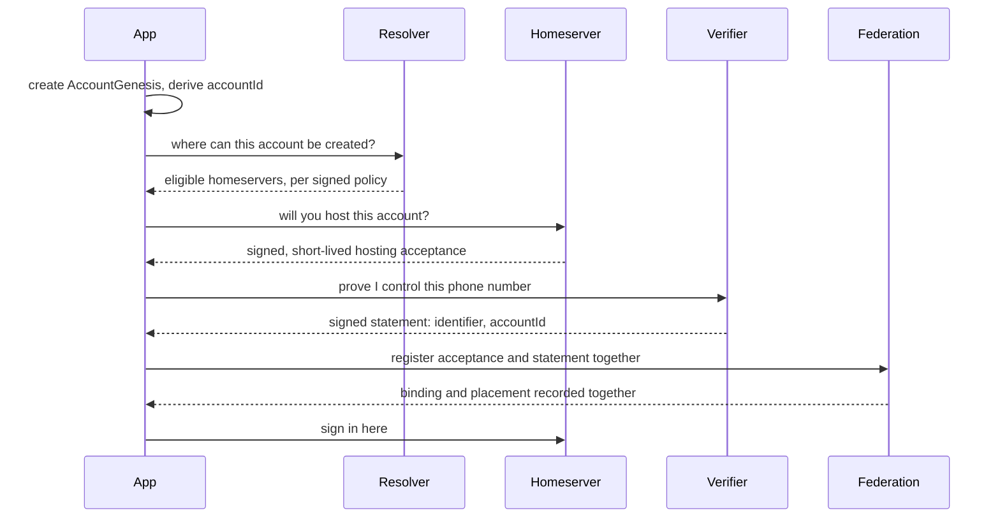
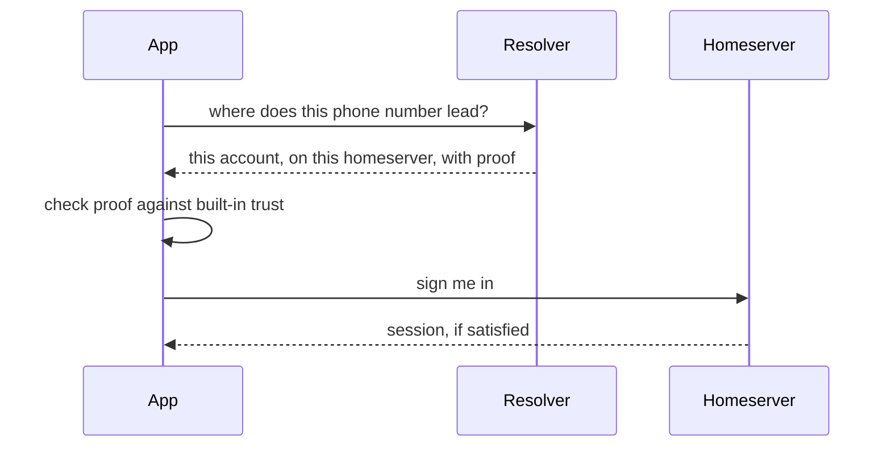

# Gua identity and federation: how accounts find their home

> **Status: TARGET ARCHITECTURE, governed by [ADM-001](../decisions/ADM-001-identifier-binding-placement-trust.md).**
> Everything before [What exists today](#what-exists-today) describes the target, built or not. That section is the line between target and current implementation.

## Why Gua needs a resolver

Gua is not one server. It is a federation of many trusted homeservers, each run independently and holding its own users' accounts and messages.

When someone types their number into the app on a new phone, the app must first find the right homeserver. That is the resolver's job.

That one question hides four:

- **Allocation:** Where should a new account be created?
- **Placement:** Where does an existing account live?
- **Binding:** Which Gua account does this phone/email/etc. refer to?
- **Authentication:** Is this person allowed into that account right now?

The federation coordinates binding and placement. The homeserver owns authentication. The resolver serves and verifies routing information and never authenticates anyone.

## Allocation

Someone signs up with no account anywhere, so a homeserver must be chosen. The federation agrees rules for that choice: which homeservers accept new users, their capacity, the person's region, their organisation.

Allocation is a proposal, not a record. Nothing is committed until the account exists.

## Placement

Once an account exists, it lives on exactly one homeserver. Placement is the committed fact of where. It changes only through a deliberate migration, never because a routing rule was edited.

Allocation is like the rule for where new pupils go; placement is the class register. Changing the rule moves nobody.

## Identifier binding

A phone number, email address or organisation login is an identifier: what a person types on a new device to reach their account. A binding is the record "this identifier refers to that account".

A binding is an attribute of the account, not the account itself. If a carrier reassigns a phone number, the binding moves to the new owner. The old account, its history, credentials and placement stay put.

A binding rests on a signed statement from an identifier verifier, a party that checks the person really controls the identifier. Verifiers are accredited by federation governance: the small group whose keys define membership and routing rules.

## Authentication

Finding an account is not getting in. Authentication is the homeserver checking a passkey, PIN, one-time code or organisation sign-on, then deciding whether to open the door.

Proving you control a phone number never opens an account. It gets you to the right homeserver, which decides whether to let you in.

## Stable Gua account identity

A Gua account needs a name that survives change. A person may change phone number or homeserver without becoming a different account.

Gua gives every account an `AccountGenesis`: a small, unchangeable object created on the person's device at signup. It records the account's initial authority key, the framework for later recovery, and the algorithms in use. Its cryptographic fingerprint is the `accountId`.

It holds no identifier and no homeserver. Both can change; the `accountId` cannot.

## New-account flow

No party can create a bound account alone. The homeserver agrees to host, which proves nothing about the identifier. The verifier confirms the person controls the identifier but cannot place the account. The app ties the two under the account's own authority. The federation records binding and placement together or not at all.

## Returning-user flow

The resolver names the account and its homeserver, and proves it. It did not check a code, see a passkey or judge who this person is.

## Why clients can verify resolver information

Anyone can run a resolver, and running one grants no authority, so the design must survive one that lies. A resolver serves records it did not write and cannot forge:

- The member list is signed by federation governance and published in a tamper-evident log.
- Each member signs its own address and keys; governance can admit or remove a homeserver, not redefine one.
- Each binding is signed by the verifier that checked it, each placement by the homeserver that holds the account.
- The app ships with the federation's root trust built in and checks every answer back to it.

An invented binding or fake homeserver has no valid signature. An old answer fails a freshness check. Independent parties watch the published history and catch a rewritten one. A dishonest resolver can still refuse or stall. That is a reliability problem, not a security one, and why anyone can run another resolver.

Full reasoning: [ADM-001](../decisions/ADM-001-identifier-binding-placement-trust.md).

## What exists today

Everything above is target. On `main` today:

**Built and carried forward:**

- A roster of federation members in a tamper-evident log, with k-of-n signing (one key today).
- Signed routing policy bundles, separate from membership.
- Signed, short-lived routing claims that cannot be replayed: an organisation's sign-on vouching for a person during onboarding.
- Clients that ask the resolver by phone number and connect where it points.

**Built, being replaced:**

- One global identity-service holding credentials and login for every homeserver. The target moves authentication to each homeserver; the decision record and a follow-up cover its future role.
- A directory of phone-number fingerprints any member can write to. The target replaces it with verifier-signed bindings; the write endpoint is scheduled for removal.
- Routing computed per request from policy, with no committed placement record. The target makes placement a signed record.

**Not built yet:**

- `AccountGenesis` and the `accountId`.
- Binding and placement records, and the three-party registration.
- Homeserver self-signed roster entries and the app-side verification chain.
- Per-homeserver authentication, including passkeys checked by the homeserver, not centrally.
- A second operator. Until one exists, the design's independence guarantees are not in effect.

See also: [verification protocol](../verification/gua-resolver-verification-protocol.md) (current implementation), [migration plan](../migrations/gua-resolver-migration-plan.md), [August 2026 federation validation](../validation/federation-e2e-2026-08.md) (historical, not normative), [July 2026 resolver design](history/gua-resolver-target-architecture-2026-07.md) (superseded, kept for provenance).

## What is target architecture

The decision record groups frozen decisions as locked, open, or spikes. Locked decisions are reopened by evidence, not by argument. Locked:

- the four-way separation above;
- `AccountGenesis` and `accountId`;
- three-party registration;
- verifier-signed bindings, with a policy-set number of independent verifiers per identifier type;
- homeserver-signed identity under a pinned federation root;
- a published federation history checked by independent witnesses;
- removal of the two current paths that let one party bind an identifier or open an account without the homeserver.

## Important open work

Tracked in [the decision record](../decisions/ADM-001-identifier-binding-placement-trust.md):

- **Passkeys on a new device.** The app must know which homeserver to ask before it can offer a passkey, without discovery becoming central login.
- **Account recovery.** Losing a device and all recovery factors, since some losses must stay unrecoverable to avoid a takeover path.
- **Lookup privacy at national scale.** Phone numbers are guessable, so lookups must resist bulk enumeration while staying verifiable. Needs cryptographic review.
- **Resolver bootstrapping.** How additional resolvers start and stay trustworthy, and what happens if governance keys are lost.
