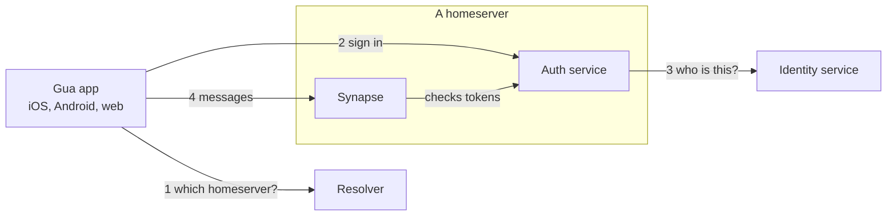
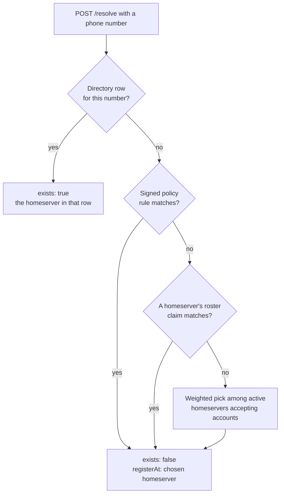
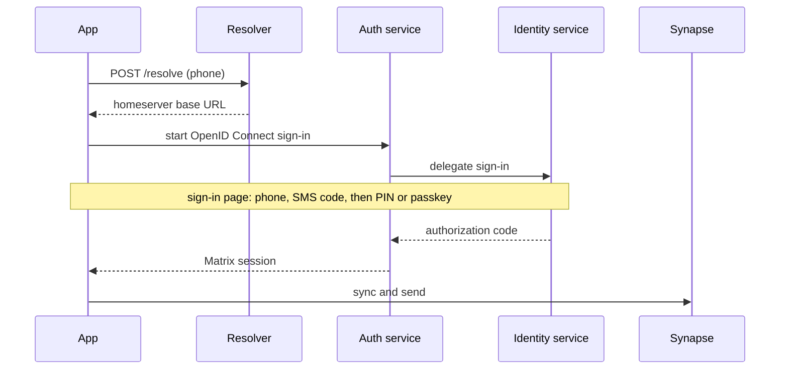
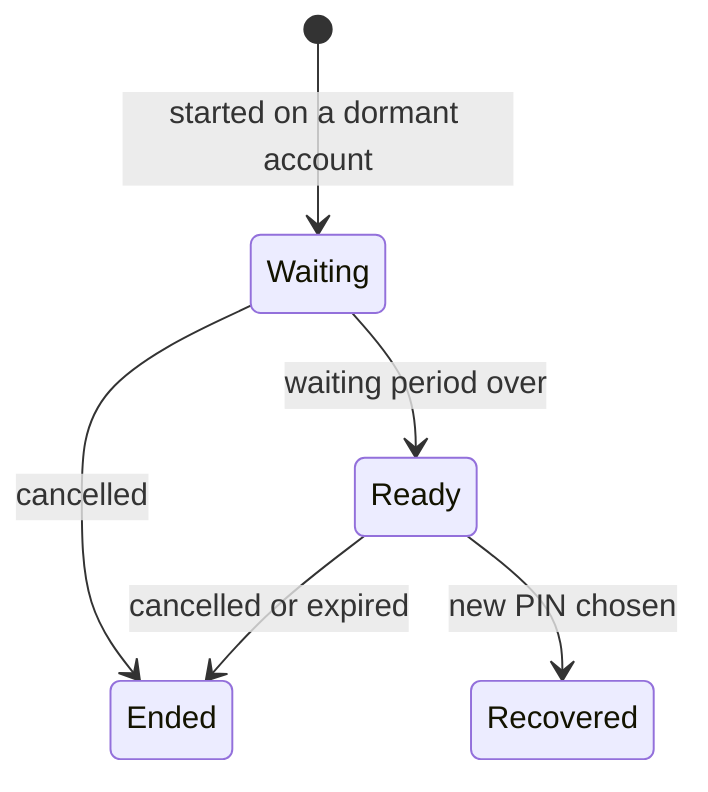

# Gua identity and federation

How a Gua account is named, where it lives, how a person signs in, and what homeservers share. Everything here describes the system as it runs today unless a section says otherwise.

## The parts


```mermaid
flowchart LR
    App["Gua app<br/>iOS, Android, web"]
    Resolver["Resolver"]
    IDS["Identity service"]
    subgraph HS["A homeserver"]
        Auth["Auth service"]
        Synapse["Synapse"]
    end
    App -- "1 which homeserver?" --> Resolver
    App -- "2 sign in" --> Auth
    Auth -- "3 who is this?" --> IDS
    App -- "4 messages" --> Synapse
    Synapse -- "checks tokens" --> Auth
```

| Part | Repository | Owns |
| --- | --- | --- |
| Resolver | `gua-resolver` | The list of homeservers, the routing rules, and the answer to "which homeserver for this phone number". No credentials, no sessions. |
| Synapse | upstream | The Matrix account, rooms, encrypted messages, device list and encrypted key backup. |
| Auth service | `gua-auth-service`, a fork of Matrix Authentication Service | Matrix sessions and access tokens. One runs beside each homeserver. |
| Identity service | `identity-service` | Phone verification, PIN, passkeys, account recovery, usernames, contact discovery and the account identifier. One serves every homeserver. |
| Sign-in page | `gua-idp-web` | The web page the identity service uses for sign-in, shown by the apps in a system browser sheet. |

One operator runs all of these today.

## What a Gua account is

One person's profile, conversations and credentials. It is created when a phone number completes signup, and it lives on exactly one homeserver.

An account has four names, each with its own job:

| Name | Looks like | Who sees it | Job |
| --- | --- | --- | --- |
| Username | `maria` | Everyone | The public identity. |
| Phone number | `+55 11 98765 4321` | The identity service | How the owner signs in, and how people who already have the number find them. |
| Matrix ID | `@maria:gua.example` | Nobody, in the product | The address the Matrix protocol uses. |
| Account identifier | `ga1aea…`, 58 characters | Nobody | A permanent internal name that outlives a change of phone number. |

## The public identity

A person is known on Gua by a **username** and a display name. The username is chosen at signup: 3 to 30 characters from lowercase letters, digits, dot, underscore and dash, not all digits. It is unique, ignoring case, across every homeserver that shares the identity service.

People find each other by username, or through contact discovery: the app sends the numbers in the address book over TLS, and the identity service answers with the ones that have accounts. An account can opt out of being found this way.

The phone number is not a public identity. It can change and the account stays the same.

## The Matrix ID

Gua is built on Matrix, and Matrix addresses every user as `@localpart:server`. The localpart is the username. The server is the Matrix name of the homeserver that holds the account. Rooms, messages and device keys all refer to this ID, and every message is signed by the server it names.

Two consequences:

- The apps hide it. Screens show the username without the server and never say "Matrix ID".
- It is permanent. The server name is part of the address, so an account cannot move to another homeserver and keep its identity. Gua offers no per-account move. See [planned federation work](planned-federation-work.md#moving-an-account-to-another-homeserver).

The Matrix ID is also the subject the identity service reports to the auth service when someone signs in.

## What the homeserver owns

A homeserver is Synapse plus its auth service.

- **Synapse** holds the account's rooms, memberships, encrypted messages, device list, public device keys and an encrypted backup of message keys. It cannot read message content.
- **The auth service** issues and revokes Matrix sessions. Synapse accepts no password of its own and trusts only tokens from its auth service.

The auth service holds no credentials either. It sends every sign-in to the identity service over OpenID Connect and creates the Matrix user on first sign-in from the username the identity service reports. So today the homeserver owns the account's data and sessions, and the identity service decides who gets in.

## What the resolver does

The apps ship with no server address. Before sign-in they ask the resolver which homeserver a phone number leads to.

The resolver publishes:

- **The roster** (`GET /roster`): every homeserver with its id, Matrix server name, base URL, auth issuer, region and status, signed by the resolver operator's keys.
- **The routing policy** (`GET /policy/routing`): signed rules that send new accounts to a homeserver by phone prefix, institution domain or sign-on issuer. Institution and issuer rules apply only when the request carries a routing claim that is signed by a trusted key, bound to that phone number, valid for at most 5 minutes and accepted once. A caller's own word is never enough.
- **A transparency log** (`GET /roster/log`): a list of every roster and policy change that can only be added to. Each entry is hashed into a tree, so anyone who kept an earlier copy can detect a rewritten history.

It never sees a code, a PIN or a passkey, and never issues a session.

## How a phone number is resolved


```mermaid
flowchart TD
    Q["POST /resolve with a phone number"] --> D{"Directory row<br/>for this number?"}
    D -- yes --> E["exists: true<br/>the homeserver in that row"]
    D -- no --> P{"Signed policy<br/>rule matches?"}
    P -- yes --> N["exists: false<br/>registerAt: chosen homeserver"]
    P -- no --> C{"A homeserver's roster<br/>claim matches?"}
    C -- yes --> N
    C -- no --> W["Weighted pick among active<br/>homeservers accepting accounts"]
    W --> N
```

```sh
curl -s -XPOST https://resolver.example/resolve \
  -H 'content-type: application/json' -d '{"phone":"+5511987654321"}'
```

```json
{
  "exists": false,
  "homeserver": null,
  "registerAt": {
    "serverName": "gua.example",
    "baseUrl": "https://matrix.gua.example",
    "masIssuer": "https://account.gua.example",
    "region": "br"
  }
}
```

What to know about this answer:

- **The directory is read-only.** It maps a hash of a phone number, computed with a secret key, to a homeserver id. It holds a fixed set of older numbers and nothing can add to it.
- **For every other number the answer is a rule evaluation, not a record.** `exists: false` means "no directory row", not "no account". The app starts sign-in at the returned homeserver either way, and the identity service decides whether this is a returning user or a new one.
- **Usernames resolve at the identity service**, which maps a username to its Matrix ID. The roster carries each homeserver's search visibility for username search across homeservers.
- **The endpoint is public.** It needs no session. Each client address may ask 20 times a minute, with IPv6 counted per /64, and each resolver pod answers at most 200 requests a second. Over either limit the answer is `429` with `Retry-After` and a fixed body, sent without reading the request body, so a refusal reveals nothing about the number. `exists` stays in the answer because both apps choose between sign-in and signup from it. The settings are `gua.resolver.abuse.*`, and `ResolveAbuseControlsTest` holds the contract.

Signed records of where each account lives exist in code and are switched off. See [account identifiers and placement records](../specs/account-identifiers-and-placement-records.md).

## How sign-in works


```mermaid
sequenceDiagram
    participant App
    participant Resolver
    participant Auth as Auth service
    participant IDS as Identity service
    participant HS as Synapse
    App->>Resolver: POST /resolve (phone)
    Resolver-->>App: homeserver base URL
    App->>Auth: start OpenID Connect sign-in
    Auth->>IDS: delegate sign-in
    Note over App,IDS: sign-in page: phone, SMS code, then PIN or passkey
    IDS-->>Auth: authorization code
    Auth-->>App: Matrix session
    App->>HS: sync and send
```

- **The SMS code never completes a sign-in.** It proves control of a number, which a SIM swap also gives. Finishing needs a passkey, the PIN, the first factor created during signup, or a completed recovery.
- **New account:** choose a username, then register a passkey. Whoever cannot or will not use a passkey must set a PIN.
- **Returning account with a PIN:** enter the PIN, or use a passkey instead.
- **Returning account with only a passkey:** the passkey is required.
- **Passkey first:** a user can sign in with a passkey without typing a number. No SMS is sent. This path skips the resolver and uses the app's default homeserver.
- **Every sign-in is fresh.** The apps use an ephemeral browser session and ask for a new login each time, so a cached browser session never signs anyone in.

## Account security

| Factor | What it proves | Rules |
| --- | --- | --- |
| SMS code | Control of the phone number now | 6 digits, 5 minutes, limited sends per number and per address. Never sufficient alone. |
| PIN | Knowledge | 6 digits. Repeated, sequential and common PINs are refused. 5 wrong attempts lock it for 15 minutes. |
| Passkey | Possession of a registered device or credential manager | WebAuthn, verified by the identity service. The relying party ID is the Gua brand domain, and the sign-in host is the allowed origin. |

Two limits on passkey checks: signature counters are not validated, because synced passkeys never increment them, and any authenticator model is accepted, because attestation is not required to be trusted.

A passkey is bound to the **account identifier**, not to the phone number or the Matrix ID. Every account has an identifier, derived from random bytes when the account is created. Nothing else reads it: not routing, not login, not a token. Its format is in [account identifiers and placement records](../specs/account-identifiers-and-placement-records.md).

Changing what guards an account always needs more than a session:

- **Adding a PIN or passkey from settings** needs a step-up first: an existing passkey, else the PIN, else an SMS code to the account's own number when it has no factor.
- **Deactivating, resetting encryption or changing the number** each need a fresh SMS code scoped to that one operation.
- **Changing the number** also needs a passkey or the PIN, then a code sent to the new number, and is limited to once per 24 hours.
- **A PIN or passkey less than 7 days old cannot authorize a number change**, so someone who steals a session cannot add a factor and then move the number.

## Devices and message keys

Messages are end-to-end encrypted with Matrix's encryption. Each device generates its own keys. The homeserver holds public device keys and an encrypted backup of message keys, and can read neither the messages nor the backup.

A new device restores earlier messages from a device that is already signed in, after the two are verified by comparing emoji. Gua never shows a recovery key, and the account PIN is never used to protect message keys, because six digits can be guessed offline.

Without another device, the user resets the encrypted backup. Messages saved only in that backup are lost, messages already on a device are unaffected, and contacts are told that the person's security details changed.

## Changing device or losing access

| Situation | What happens |
| --- | --- |
| New phone, same number, PIN or passkey available | Sign in, then restore earlier messages from the old device. |
| No other device to restore from | Sign in and reset the encrypted backup. The account, contacts and conversations remain. Messages saved only in the backup are lost. |
| New phone number, still signed in | Change the number in settings. Username, Matrix ID and conversations are unchanged. |
| PIN forgotten or passkey lost, number still held | Delayed account recovery, below. |
| Someone else gets the number: SIM swap or a recycled number | They receive codes and cannot finish sign-in without the PIN or passkey. They can start recovery only on a dormant account, and the owner can cancel it. |
| Number, PIN and passkey all lost | No way back in. A path that recovers an account from nothing is also a path to take one over from nothing. |

### Delayed account recovery

For someone who proved the number by SMS code and cannot present the PIN or passkey.


```mermaid
stateDiagram-v2
    [*] --> Waiting: started on a dormant account
    Waiting --> Ready: waiting period over
    Waiting --> Ended: cancelled
    Ready --> Ended: cancelled or expired
    Ready --> Recovered: new PIN chosen
```

- It can start only when the account has had no completed sign-in for the dormancy period, and can finish only after the waiting period. Both default to 7 days and cannot be set below 24 hours outside development.
- While it is pending, every signed-in app shows a banner with a cancel button. Any sign-in with the PIN or a passkey also cancels it.
- Finishing sets a new PIN, removes every passkey and signs out every other session. The new PIN then falls under the 7 day rule above.
- Starting it sends no SMS, and nothing shortens the two waits.

## Federated versus local

| | Scope today |
| --- | --- |
| Messages and rooms | Federated between Gua homeservers over Matrix federation. Gua is a closed federation and does not join the open Matrix network. |
| Roster, routing policy, transparency log | Federation-wide, published by the resolver. |
| Matrix account, sessions, devices, key backup | Local to one homeserver. |
| Sign-in, PIN, passkeys, recovery, usernames, contact discovery, account identifiers | Central. One identity service serves every homeserver. |
| Who may join or leave the roster | The resolver operator. |

## How a resolver answer can be checked

- The roster carries signatures from the operator's keys, and a set minimum number of them must be valid.
- Each roster names the size and root hash of the transparency log at that moment, and the log can prove that it only grew since any earlier one.
- A routing policy bundle is signed, appears in the log, and limits each delegated rule set to the homeservers and scope it was granted.
- A homeserver can sign its own roster entry, so the operator cannot quietly change its address or key. Built, and optional until every homeserver has signed.
- Membership changes can require signatures from governance keys held outside the resolver, anchored in a federation root that apps would pin. Built, and switched off.

The [verification protocol](../verification/gua-resolver-verification-protocol.md) is the step by step algorithm. The byte formats are in [signed federation objects](../specs/federation-signed-objects.md).

Limits to keep in mind:

- The apps do not run these checks yet. They use the resolver's answer as received.
- One operator holds every key, so none of this protects against that operator.
- For an `exists: true` answer a client can check that the homeserver is active in the roster, not that the account lives there.
- The stored phone hashes can be reversed by anyone who holds both the stored values and the secret they are keyed with.

What closing these gaps requires is in [planned federation work](planned-federation-work.md).

## In development: account authority

Open pull requests in the resolver, the identity service, both apps and the sign-in page add account authority: signing keys held on a person's devices and recorded in an append-only chain per account, so that adding or removing a device is approved by a device the account already trusts, and the phone number alone authorizes none of it. It is switched off everywhere and no account uses it. Nothing above depends on it.
