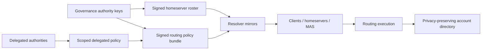

# Gua Resolver Target Architecture

Date: 2026-07-03

## Goals

The resolver must hide Matrix homeserver and federation complexity from users without becoming:

1. a single point of failure,
2. a high-value central dependency,
3. a governance bottleneck,
4. an opaque central authority.

## Core Principle

Split:

- **policy authority**: decides and signs trust/routing policy,
- **policy serving**: mirrors and distributes signed artifacts,
- **routing execution**: resolves a user context to a homeserver from verified artifacts.

Resolver nodes should be verifiers and distributors, not the sole source of truth.

## Target Components

## Artifacts

### Signed Homeserver Roster

Purpose: answer "which homeservers are trusted members of the federation?"

Properties:

- canonical serialization,
- version,
- validity/checkpoint,
- transparency-log root,
- k-of-n signatures,
- active/suspended/revoked lifecycle,
- membership public keys,
- MAS issuer and client base URL metadata.

Already implemented.

### Signed Routing Policy Bundle

Purpose: answer "given a verified onboarding context, what deterministic routing rules apply?"

Properties implemented in this pass:

- schema version,
- policy id,
- monotonic version,
- issued/not-before/expires timestamps,
- delegation zones,
- rules,
- fallback declaration,
- detached signatures,
- canonical serialization,
- Ed25519 verification,
- validation against active roster,
- public distribution endpoint.

### Delegation Zones

A delegation zone binds a delegate to an explicit bounded scope:

- phone prefix scope,
- institution domain scope,
- OIDC issuer scope,
- attribute scope.

Rules cannot target a homeserver outside the zone's allowed homeserver ids, and a rule match must be
within the zone scope.

### Directory

Current state:

- authority-owned online directory,
- peppered phone HMAC,
- username index,
- membership-signed writes,
- no bulk export.

Target state:

- signed directory checkpoints or shard manifests,
- privacy-preserving mirrorable subset where feasible,
- clear fail-open/fail-closed policy,
- mutation audit hashes,
- portability/reassignment fields.

## Resolver Node Roles

### Authority Node

- admits homeservers,
- appends roster and policy hashes to transparency log,
- signs artifacts or aggregates co-signatures,
- may own directory writes.

### Mirror Node

- pulls signed roster and policy artifacts,
- verifies signatures,
- verifies consistency/checkpoints,
- serves artifacts locally,
- executes routing from verified artifacts,
- exposes staleness health.

### Institutional Node

- may serve an institution-specific mirror,
- may add local policy only if scoped by an upstream delegation zone,
- must never mint global membership by itself.

### Public Fallback Node

- serves public onboarding policy and roster,
- can be one of several equivalent mirrors.

## Deterministic Routing Algorithm

1. Normalize and validate input.
2. For existing-account lookup, query directory.
3. If directory maps to an active roster entry, return it.
4. For new placement, load highest-version verified routing policy.
5. Evaluate policy rules by `priority`, then `id`.
6. If no policy match, evaluate legacy signed-roster claims by claim priority and homeserver id.
7. If no claim match, run stable weighted fallback using context, roster version, homeserver ids, and weights.
8. Return decision trace if requested.

## Fail-Open And Fail-Closed Strategy

| Surface | Recommended Behavior |
| --- | --- |
| `/roster` | Fail closed if no verified roster exists; serve last verified roster if within staleness budget. |
| `/policy/routing` | Fail closed if no verified policy exists and policy is required; serve last verified policy if within staleness budget. |
| `/resolve` existing directory | Prefer fail closed or "retry" when directory backend is unavailable; avoid treating outage as no account. |
| `/resolve` new placement | Can fail open to stable fallback only when policy explicitly permits it. |
| `/authority/**` | Fail closed. |
| `/directory/entries` | Fail closed on invalid signatures; homeservers may retry asynchronously. |

## MAS / OIDC Native Deployments

Resolver should receive verified identity context from MAS/identity-service, not self-asserted browser
claims. The future secure shape is:

- MAS verifies external IdP,
- MAS or identity-service issues a signed routing-claims envelope,
- resolver verifies issuer/audience/expiry/signature, enforces the configured maximum lifetime, and records
  the claims nonce in the shared replay table,
- routing policy matches OIDC issuer, verified domain, assurance level, and account-linking state,
- directory residence remains separate from authentication source.

## Public And Institutional Product Compatibility

Public onboarding:

- policy can route by geography/weight/public fallback,
- users remain portable unless policy says otherwise,
- no institution-specific claim required.

Institutional onboarding:

- institution receives a signed delegation zone,
- policy routes only verified affiliations or OIDC issuer claims,
- assignment policy can require confirmation or explicit lock,
- institutional resolver mirrors the same signed global roster.

## Implementation Status After This Pass

Implemented:

- deterministic fallback,
- placement decision trace,
- signed routing-policy domain model,
- routing policy canonicalization/sign/verify,
- validation against roster and delegation zones,
- signed routing-claims envelopes for MAS/identity-service attributes,
- file-backed policy source,
- optional mirror roster cache,
- fail-closed mirror directory lookup,
- DB-backed replay protection for signed routing-claims nonces,
- policy status and distribution endpoints,
- policy-backed placement rule,
- security default deny,
- correlation id propagation,
- tests for policy routing and validation.

Still needed:

- remote policy source,
- persistent policy cache and staleness health,
- policy transparency log,
- directory high-availability design,
- production domain proof verifier,
- client-side verifier libraries,
- deployment HA changes.
