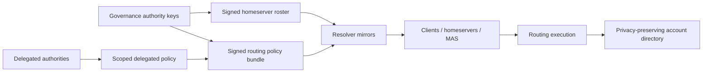

> **Status: HISTORICAL VALIDATION/DESIGN.** A design document from July 2026, preserved for provenance. **Not normative.**
>
> This was the resolver's target architecture before [ADM-001](../../decisions/ADM-001-identifier-binding-placement-trust.md) was frozen. Its core principle is that resolver nodes should be verifiers and distributors rather than the sole source of truth. That principle is carried forward unchanged. It is the foundation of the current design.
>
> Three things in it are superseded and should not be relied on:
>
> - **The directory model.** It describes a privacy-preserving account directory that federation members write to directly. ADM-001 replaces member-written directory entries with binding records attested by accredited identifier verifiers. A member's own statement must never be sufficient to claim an identifier.
> - **Placement as routing execution.** It treats where an account lives as the output of routing rules applied to a verified context. ADM-001 separates allocation, a proposal for new accounts, from placement, a committed and signed record for existing ones. It forbids routing rules from silently moving an existing account.
> - **The trust root.** It roots trust in configured authority keys. ADM-001 roots it in a pinned federation genesis with a threshold governance set. It also requires each member to self-sign its own endpoint metadata. Governance can then admit or remove a member but cannot redefine one.
>
> The current guide is [gua-identity-and-federation.md](../gua-identity-and-federation.md).

# Gua Resolver Target Architecture

Date: 2026-07-03

## Goals

The resolver must hide Matrix homeserver and federation complexity from users without becoming:

1. a single point of failure,
2. a high-value central dependency,
3. a governance bottleneck,
4. an opaque central authority.

## Core Principle

Split:

- **policy authority**: decides and signs trust/routing policy,
- **policy serving**: mirrors and distributes signed artifacts,
- **routing execution**: resolves a user context to a homeserver from verified artifacts.

Resolver nodes should be verifiers and distributors, not the sole source of truth.

## Target Components

## Artifacts

### Signed Homeserver Roster

Purpose: answer "which homeservers are trusted members of the federation?"

Properties:

- canonical serialization,
- version,
- validity/checkpoint,
- transparency-log root,
- k-of-n signatures,
- active/suspended/revoked lifecycle,
- membership public keys,
- MAS issuer and client base URL metadata.

Already implemented.

### Signed Routing Policy Bundle

Purpose: answer "given a verified onboarding context, what deterministic routing rules apply?"

Properties implemented in this pass:

- schema version,
- policy id,
- monotonic version,
- issued/not-before/expires timestamps,
- delegation zones,
- rules,
- fallback declaration,
- detached signatures,
- canonical serialization,
- Ed25519 verification,
- validation against active roster,
- public distribution endpoint.

### Delegation Zones

A delegation zone binds a delegate to an explicit bounded scope:

- phone prefix scope,
- institution domain scope,
- OIDC issuer scope,
- attribute scope.

Rules cannot target a homeserver outside the zone's allowed homeserver ids, a rule match must be within the
zone scope, and a rule is only applied while its zone's signed `notBefore`/`expiresAt` window is open.

Delegation is now **cryptographic**, not just authority-signed policy-as-data. Each zone carries a delegate
public key (`delegateKeyId` + `delegatePublicKey`) that the authority attests by threshold-signing the whole
bundle; the delegate independently signs the rules inside its own zone (`CanonicalDelegatedRules`, bound to
policyId + version + zoneId). A rule is applied only when its zone is BOTH authority-attested and
delegate-signed, so a delegate authors and controls its own rules within an authority-granted scope and no one
(including the authority) can forge them. A zone whose delegate key is an authority key is authority
self-delegation (public onboarding rules).

### Directory

Current state:

- authority-owned online directory,
- peppered phone HMAC,
- username index,
- membership-signed writes,
- no bulk export.

Target state:

- signed directory checkpoints or shard manifests,
- privacy-preserving mirrorable subset where feasible,
- clear fail-open/fail-closed policy,
- mutation audit hashes,
- portability/reassignment fields.

## Resolver Node Roles

### Authority Node

- admits homeservers,
- appends roster and policy hashes to transparency log,
- signs artifacts or aggregates co-signatures,
- may own directory writes.

### Mirror Node

- pulls signed roster and policy artifacts,
- verifies signatures,
- verifies consistency/checkpoints,
- serves artifacts locally,
- executes routing from verified artifacts,
- exposes staleness health.

### Institutional Node

- may serve an institution-specific mirror,
- may add local policy only if scoped by an upstream delegation zone,
- must never mint global membership by itself.

### Public Fallback Node

- serves public onboarding policy and roster,
- can be one of several equivalent mirrors.

## Deterministic Routing Algorithm

1. Normalize and validate input.
2. For existing-account lookup, query directory.
3. If directory maps to an active roster entry, return it.
4. For new placement, load highest-version verified routing policy.
5. Evaluate policy rules by `priority`, then `id`.
6. If no policy match, evaluate legacy signed-roster claims by claim priority and homeserver id.
7. If no claim match, run stable weighted fallback using context, roster version, homeserver ids, and weights.
8. Return decision trace if requested.

## Fail-Open And Fail-Closed Strategy

| Surface | Recommended Behavior |
| --- | --- |
| `/roster` | Fail closed if no verified roster exists; serve last verified roster if within staleness budget. |
| `/policy/routing` | Fail closed if no verified policy exists and policy is required; serve last verified policy if within staleness budget. |
| `/resolve` existing directory | Prefer fail closed or "retry" when directory backend is unavailable; avoid treating outage as no account. |
| `/resolve` new placement | Can fail open to stable fallback only when policy explicitly permits it. |
| `/authority/**` | Fail closed. |
| `/directory/entries` | Fail closed on invalid signatures; homeservers may retry asynchronously. |

## MAS / OIDC Native Deployments

Resolver should receive verified identity context from MAS/identity-service, not self-asserted browser
claims. The future secure shape is:

- MAS verifies external IdP,
- MAS or identity-service issues a signed routing-claims envelope **bound to the subject phone**,
- resolver verifies issuer/audience/expiry/signature, enforces the configured maximum lifetime, enforces that
  the envelope subject equals the request phone (so a captured envelope cannot be replayed against another
  number), and records the claims nonce in the shared replay table,
- only affiliations/attributes from a verified envelope are trusted for institution/OIDC placement; a public
  caller's self-asserted affiliations/attributes are never trusted for privileged routing (they are dropped),
- routing policy matches OIDC issuer, verified domain, assurance level, and account-linking state,
- directory residence remains separate from authentication source.

## Public And Institutional Product Compatibility

Public onboarding:

- policy can route by geography/weight/public fallback,
- users remain portable unless policy says otherwise,
- no institution-specific claim required.

Institutional onboarding:

- institution receives a signed delegation zone,
- policy routes only verified affiliations or OIDC issuer claims,
- assignment policy can require confirmation or explicit lock,
- institutional resolver mirrors the same signed global roster.

## Implementation Status After This Pass

Implemented:

- deterministic fallback,
- placement decision trace,
- signed routing-policy domain model,
- routing policy canonicalization/sign/verify (k-of-n threshold, per-key dedup),
- injective canonical serialization for routing-claims (escaped delimiters; no signature-covers-a-different-
  claim-set ambiguity),
- validation against roster and delegation zones, with zone validity-window enforcement at evaluation time,
- signed routing-claims envelopes for MAS/identity-service attributes, with subject/phone binding and the
  replay/lifetime/nonce checks,
- verified-claims gate on ALL institution/OIDC placement (both signed-policy rules and legacy roster claims);
  self-asserted affiliations/attributes are dropped and can never be self-asserted as "verified",
- file-backed policy source with monotonic-version rollback protection and refusal to serve/apply a bundle
  outside its signed validity window,
- optional mirror roster cache,
- fail-closed mirror directory lookup with a hard per-lookup timeout (a stalled authority cannot hang mirror
  threads),
- DB-backed replay protection for signed routing-claims nonces,
- policy status and distribution endpoints,
- policy-backed placement rule,
- security default-deny with HTTP Basic admin auth on `/authority/**` (fails closed with no admin credential),
- clean 503 (not 500) when no homeserver accepts new accounts,
- correlation id propagation,
- **per-delegate cryptographic delegation**: each zone carries a delegate key the authority attests, and the
  delegate signs its own zone's rules; a rule applies only when both verify (governance-bottleneck fix),
- **policy transparency log**: every adopted policy version is appended to the Merkle log (`POLICY_PUBLISH`),
  covered by the published checkpoint + consistency proofs, so policy cannot be equivocated undetectably,
- **reference client verifier + verification protocol spec**
  (`ResolverVerifier` + docs/verification/gua-resolver-verification-protocol.md): a client verifies the signed
  roster + policy and independently reproduces the deterministic decision (opaque-authority fix),
- **signed, transparency-logged directory checkpoints** (Merkle root over the mappings, `DIRECTORY_CHECKPOINT`)
  plus a mirror serve-stale-within-budget cache so returning-user login survives a brief authority outage,
- tests for delegation (delegate-signed vs forged), policy transparency, the reference verifier, directory
  checkpoints + mirror stale-serve, threshold, subject binding, canonical injectivity, rollback/expiry, the
  self-assertion regression, and deny-by-default authz.

Still needed (deferred):

- **native client verifier libraries** (web / iOS / Android) implementing the verification protocol spec, so
  end-user apps verify decisions on-device (the Java reference verifier + spec now exist),
- **directory full inclusion proofs** (per-lookup audit path) and an untrusted-mirror replication story beyond
  the signed checkpoint + stale cache,
- remote policy source and persistent policy cache with staleness health,
- production domain proof verifier (the current `TokenPresenceVerifier` is a placeholder),
- key rotation / revocation artifacts,
- multi-party authority key custody (the code supports k-of-n; the ceremony/custody is an ops rollout),
- deployment HA changes (multi-replica + Postgres HA in gua-deploy).
