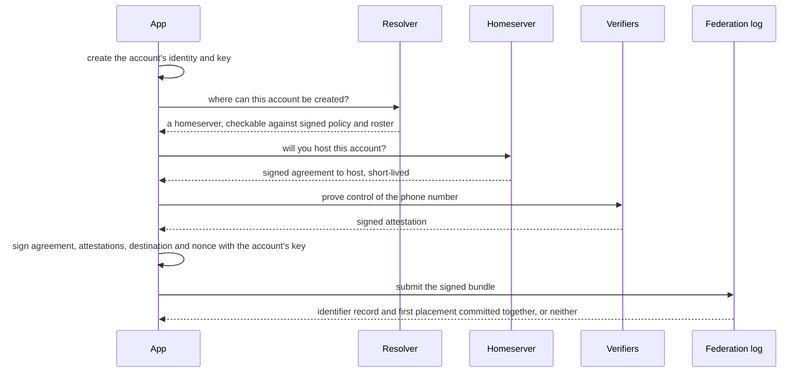
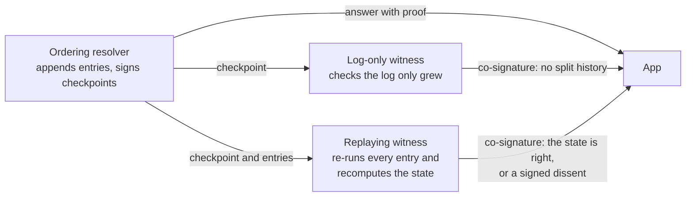

# Federation work that is not built yet

The gaps between the system described in [Gua identity and federation](gua-identity-and-federation.md) and a federation that several independent operators can trust. Each section says what is missing today, the rules any implementation must keep, and what blocks it. Nothing here is built unless a section says so. The order of work is in the [migration plan](../migrations/gua-resolver-migration-plan.md).

One operator runs every service and holds every key today. Two keys held by one operator are one party, so no property below that depends on independent parties holds yet.

## Identifier ownership attested by independent verifiers

Today the identity service's own directory is the only record of which account a phone number belongs to.

The design makes that a signed record. A verifier checks that a person controls an identifier and signs a statement. Governance accredits verifiers. A governance-signed policy per identifier type says how many independently governed verifiers must agree, which proofs are allowed and how fresh a challenge must be. Forging a record for an unused identifier then requires compromising that many verifier operators, or enough governance keys to change the policy.

Rules:

- **An identifier is an attribute of an account.** If a carrier reassigns a number and it is later tied to a new account, the old account, its history, credentials and homeserver do not move.
- **The count is of independently governed parties.** Verifiers under common control count once, whatever their keys or operator names say.
- **A check that needs a key set never falls back to a different one** when that set is missing.
- **More verifiers do not help against a SIM swap.** Whoever controls the phone number right now is truthfully attested by every honest verifier.

Open: how many verifiers each identifier type needs. Blocked by governance being enabled and by a second operator to make the count mean something.

## New accounts registered as one checkable transaction

Today the resolver picks a homeserver for a new number by evaluating policy on each request, and nothing is recorded. The weighted fallback seeds on the roster version, which is the transparency log size, so its answer can change whenever any leaf is appended.

The design:

Rules:

- The proposed homeserver stays fixed for the life of the transaction, and anyone can re-derive it from the signed policy and roster. A resolver signature that nobody can re-derive would make the resolver the placement authority.
- **A signature adds security only if obtaining it requires compromising someone.** The applicant's own signature ties the transaction together and stops replay. The homeserver's agreement does three jobs: no account is placed where nobody agreed to host it, the destination cannot drift during the transaction, and the homeserver controls its own admissions. Neither signature is a check on who owns the phone number.

[Placement records](../specs/account-identifiers-and-placement-records.md#placement-record-66--n-bytes) exist and, with their flags on, are compared daily against where accounts really live. Routing may read them only once the conditions listed in the [migration plan](../migrations/gua-resolver-migration-plan.md#phase-4-placement-records-for-existing-accounts) hold.

## Apps verifying before they connect

Today the apps hand the resolver's `baseUrl` to the Matrix SDK as received. The [verification protocol](../verification/gua-resolver-verification-protocol.md) describes what a client can check now, and a Java reference verifier exists, but no app runs it.

The design: before connecting, the app checks the pinned federation root, the roster, the homeserver's own signature on its entry, and the placement record. It ships in report-only mode first.

Open: what an app does when a homeserver's key changes in a way it cannot tell from a takeover, and how it handles a federation root newer than the one it was built with without opening a downgrade path.

## Checkpoints, witnesses and replicas

Today the transparency log proves that a history of hashes was only appended to. It does not prove what the current state is. Directory changes are not logged, the resolver stamps entries with its own clock, the answer "no account for this number" is unsigned, and two clients could be shown two different histories without noticing. Mirror mode exists and is not exercised.

The leading design is one ordering resolver, two kinds of witness, and a sparse Merkle tree so that both "this account exists" and "no such account" come with proofs.

Five properties, each bought separately. A history can be consistent, available and perfectly ordered and still be wrong.

| Property | What provides it | Broken by |
| --- | --- | --- |
| The state is computed correctly | Deterministic rules and independent replay | The ordering operator plus every replaying witness the app requires |
| Everyone sees one history | Witness co-signatures, apps pinning checkpoints, consistency proofs | The ordering operator plus enough witnesses under one control, or apps that never compare |
| Nothing is censored | Not prevented. Only detectable | The ordering operator alone |
| The service stays up | Not provided by witnesses | The ordering operator alone |
| Entries have one order | The ordering resolver | The ordering operator alone |

Rules:

- A signed checkpoint proves only that its signers signed those bytes. It says nothing about whether the state was computed correctly.
- A witness signature counts toward correctness only if that witness fetched every entry, verified it, replayed it and recomputed the state itself. It signs the size it verified up to. A witness that cannot verify does not sign. A witness whose replay disagrees publishes a signed dissent.
- A witness that only checks the log is growing consistently helps detect split histories and nothing more. Clients must be able to tell the two kinds apart.
- A witness's kind and operator are attested by governance when it is admitted, never claimed by the witness. Its identity is verified back to the federation root before any checkpoint it co-signed is accepted. Otherwise verification is circular.
- A witness run by the resolver's operator counts for nothing.
- The sets of witnesses a client accepts must overlap in at least one honest party.
- Every input that affects state, including time, is an entry in the log, so a replay sees what the resolver saw. The ordering resolver records the time and does not choose it: logged time never goes backwards and is checked against a time policy on replay. Nothing reads a local clock during replay.
- **Running a resolver grants no authority.** The number of resolvers is an availability decision, never a voting or signing one. A replica holds no key that counts.

Proposed details, not yet reviewed:

- **One checkpoint per size.** A log-only witness refuses to co-sign a second checkpoint at a size it already co-signed.
- **Quorum.** With `W` the set of witness operators and `f` of them allowed to be faulty, the number that must sign, `q`, satisfies `2q - |W| >= f + 1`. Example: four operators with one faulty need three signatures, so any two accepted sets share two operators and one of those is honest. The first step is one outside operator with `q = 1` and `f = 0`.
- **Pinning.** An app pins the last checkpoint it accepted for the federation, not per account, and moves forward only on a consistency proof and a quorum.
- **Time.** A `TICK` entry lands at least every 60 seconds. A witness co-signs only when the checkpoint's time is within 120 seconds of its own clock. A clock disagreement is never a dissent. The witness withholds its signature.
- **Dissent.** It names the last checkpoint the witness agreed with, the disputed checkpoint, the first bad entry and the evidence, so a client can check it.
- **Evidence of censorship.** An accepted input gets a signed promise that it will appear in the log within a stated delay. An unmet promise proves censorship.

Agreement among several ordering nodes is only worth its cost if the federation refuses a single ordering party or must keep running through a malicious one.

A replica design must say how a replica gets the pinned federation root, finds checkpoints, verifies a snapshot instead of trusting it, replays to the current state and behaves on a fork, and how a read-only replica differs from a node with authority. The proposed procedure: obtain the root out of band and compare its fingerprint over two channels. Verify the governance key chain and the witness list before any checkpoint. Replay from the start, or accept a snapshot whose recomputed root matches a checkpoint signed by replaying witnesses, then replay to the head. On a fork, stop and pass on the evidence.

Blocked by a second operator. The formats can be built earlier. The guarantee cannot be claimed earlier.

## Phone numbers that cannot be recovered from stored state

Today the resolver and the identity service both store an HMAC-SHA256 of the phone number under a shared secret pepper. A national numbering plan has between one and ten billion candidates, so anyone holding the stored values and the pepper recovers every number. The pepper cannot be rotated without the raw numbers. `POST /resolve` needs no session, reveals whether a number has an account, and is protected only by rate limits per client, globally and at the ingress.

Requirements:

1. No raw or cheaply reversible identifier appears in state that leaves the operator.
2. Turning a number into its lookup key requires an online evaluation that the evaluator can meter without learning the number.
3. Routine rotation of operators or key shares leaves every lookup key unchanged.
4. Once a second evaluator operator exists, no single party holds the whole key.
5. The app learns the evaluation public key from the pinned federation chain, never from the evaluator.
6. Every app sees the same public key for a key generation, so the evaluator cannot split them into groups.
7. Generations only move forward. An app refuses an older one.
8. An identifier stays unique across a change of generation.
9. Emergency re-keying uses only parties that already hold the identifier: the account's own app or an accredited verifier.
10. Controls on `/resolve` are layered, and none may assume an account session, because the endpoint is needed before any session exists.

The leading design uses the output of a verifiable oblivious pseudorandom function as RFC 9497 defines it for a single server. Several parties holding shares of one key would compute it together, with shares refreshed on rotation so stored lookup keys do not change. RFC 9497 specifies neither the sharing nor the refresh. That combination has not been validated. It needs review by a cryptographer before any of it is implemented, and the choice cannot be swapped later because every stored key depends on it.

Narrowed so far, each subject to that review:

- **No updatable construction.** One where a public token re-keys every stored value is rejected. Every replica would have to apply the token, so it is public, and with the compromised old key it yields the new key.
- **Emergency re-keying.** Governance signs a new generation and stops new bindings under the old one. Each identifier is bound again with verifier attestations that link its old and new lookup keys. Identifiers bound again stay linkable by anyone who holds the old key. Only identifiers first bound afterwards gain protection.
- **The evaluator is its own process with its own keys.** The resolver never holds a share.

## Sign-in decided by each homeserver, and passkeys

Today the identity service authenticates users for every homeserver and verifies every passkey. The passkey relying party ID is the Gua brand domain, and the sign-in host is the allowed origin.

Rules for moving authentication to each homeserver:

- **Three questions stay separate.** Which account an identifier refers to, which homeserver holds that account, and whether this person may sign in right now. The federation may answer the first two. Only the homeserver answers the third. Nothing the federation issues is a login credential or a session.
- **The test for a flow.** Was the artifact issued by a federation component? Does any party treat it as proof that the person is present now, instead of proof of who owns an identifier? Could someone holding only that artifact get a session? Does the homeserver still authenticate the person itself? A yes to the third question or a no to the fourth breaks the rule. A homeserver's own login by SMS code does not.
- Finding the homeserver happens before the passkey ceremony, because a passkey is tied to one relying party and no platform lists passkeys across relying parties.
- Whatever helps an app find its homeserver never stores a credential key and never receives an assertion. It adds no way to enumerate accounts and puts no identifier into shared state.
- A stored hint about which homeserver to use is acted on only after the app has verified that homeserver against the pinned federation chain.
- Passkey sign-in reaches only an existing account. It never creates one.
- A passkey's relying party is fixed when it is created. Homeservers run by Gua keep the Gua relying party so existing passkeys keep working. A homeserver run by someone else uses a relying party ID it controls, never one related to Gua's.
- Each homeserver allows only its own web origins plus the first-party apps, and publishes its relying party ID and origins in its self-signed roster entry.
- An assertion made for one operator never yields a session at another, including by relaying an assertion from a native app.
- A homeserver's self-signed roster entry never makes it eligible for a native passkey ceremony under the Gua relying party. A browser enforces origin for web ceremonies. A native ceremony uses the app's compiled association and does not.
- Admitting a third-party operator needs no app release. Its users run web ceremonies on its own origin.
- Existing passkeys move as data. The identity service copies each one to the homeserver that holds the account with the relying party ID unchanged, so nobody enrols again.
- The auth service keys upstream links on provider and subject and never rewrites a subject. Changing what the subject means is a new provider plus a link pass, never an edit in place.
- **The localpart trap.** The auth service takes a returning user's Matrix localpart from the username the identity service sends. If that username were computed by splitting the user id at its colon, re-keying user ids to a new format would give every returning user the same localpart, and an auth service importing with `on_conflict: add` would merge them all onto one account without an error. `LocalpartDerivationGuardTest` in identity-service fails the build if such a derivation comes back.

Blocked by its own design, which also decides what remains of the identity service afterwards.

## Moving an account to another homeserver

Gua offers no per-account move, and nothing currently needs one. Moving a whole homeserver keeps every Matrix ID and every key and is the tool for capacity.

A Matrix ID contains its server name, every event is signed by the server named in its sender, the auth service never renames a user, and no adopted Matrix feature carries device keys, verification, room membership or message attribution across servers. A move would therefore mean a new Matrix ID with conversations re-established from the user's devices: new device keys, contacts verify the person again, and earlier messages keep the old sender.

Rules if this is ever built:

- Only the account's own key can authorize a move. An account without a key cannot move, because a move started by an operator is a seizure.
- A move changes neither the account identifier nor which identifiers belong to the account.
- A move is a next-generation placement record entered in the log, never a session grant. The destination agrees to host and authenticates the person from scratch.
- Tooling runs on the user's devices through the ordinary client API, with no admin API and no trust between operators.
- A move can be abandoned without loss until the old homeserver deactivates the account.
- The old Matrix ID is never given to anyone else.
- No record, tool or screen claims the identity is the same or the move is seamless. Any claim that tooling keeps keys, verification or history across a move needs its own demonstration against the versions in use, and no design may assume it.
- The next-generation placement record carries the account identifier, the destination homeserver id, the generation, a hash of the previous record, the account key's signature, the destination's agreement to host and the logged time. It carries no Matrix ID and makes no claim about keys or verification.

Revisit when a second operator exists, when a regional or legal requirement demands it, or when Matrix merges a portability proposal that Synapse supports in a room version Gua can adopt.

## Losing the governance keys

If the governance keys are lost or compromised beyond what their own rotation rule can repair, there is no recovery inside the system. The answer today is a new federation root and new app builds that pin it. What happens to accounts and placements across such a change is undecided, and it is a governance question before it is a protocol one.

## Account authority and device lifecycle

In development on open pull requests and switched off. See the [short description](gua-identity-and-federation.md#in-development-account-authority) in the architecture guide. The rules it is built to:

- Control of a phone number never authorizes a change to an account's keys, at any step, in any combination.
- Operator action, homeserver action and elapsed time never authorize one either. An operator may suspend an account and never reassign it.
- An account without a key gains one only after a fresh strong proof on the owner's device and a waiting period in which the owner is told and can object. A homeserver or operator cannot do it on the account's behalf.
- Recovery starts only under rules the account committed to in advance, and competing changes resolve by a fixed order, never by who signs first.
- Whoever can cancel a recovery is decided in advance and is not just the key that may have been stolen.
- A stronger committed factor closes weaker paths to the account's keys.
- Waiting periods on key changes run on time recorded in the federation log, which witnesses can replay. Until witnesses exist they run on service time.
- Losing every committed factor may be final.

The design must cover a second phone, approval by QR code or by a trusted device, a lost or replaced phone, recovery, web login, and browser sessions, which may use the account and are never authority devices automatically.

Proposed order for competing key changes. It awaits a formal model and review:

- **Rotate.** Signed by the active key alone. Immediate, cannot change the recovery policy, and refused while a recovery or a policy change is pending.
- **Recover.** Needs the committed number of recovery factors, takes effect after the recovery wait, installs a new active key and cancels any pending policy change.
- **Change the recovery policy.** Needs the active key plus one committed factor and takes effect after the policy wait. Lengthening a wait applies at once. Shortening one takes effect only after the policy wait.
- **Rank** is the number of distinct committed factors that signed. A higher rank cancels a pending change. An equal rank cancels both and freezes key changes for the recovery wait. A lower rank is refused. Each cancelled attempt doubles the wait before the same signers may try again.
- **Recovery framework `0x02`** would commit a set of recovery factor keys, how many must sign, and bounds on both waits. Every committed factor is a public key, never a hash of a secret. An account under framework `0x01` follows the same order with its one recovery key and both waits fixed at 7 days.
