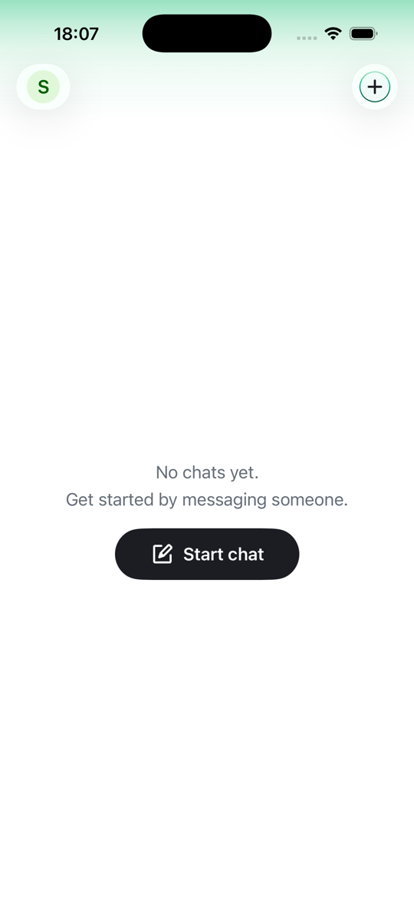
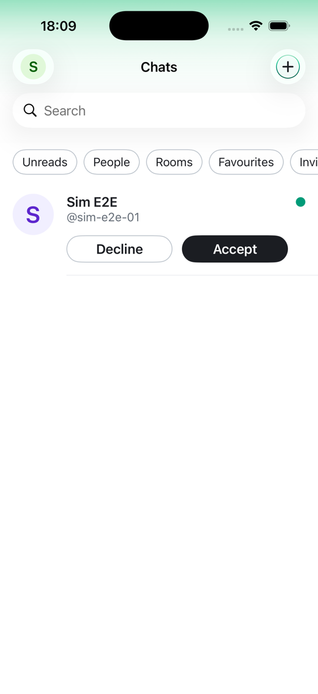
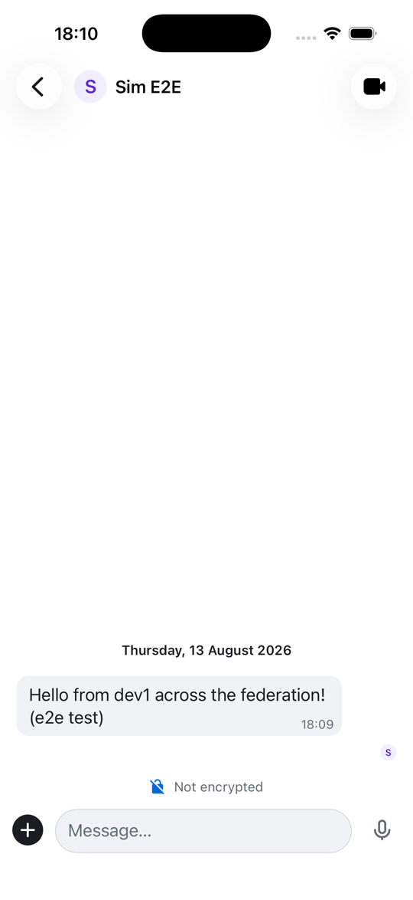
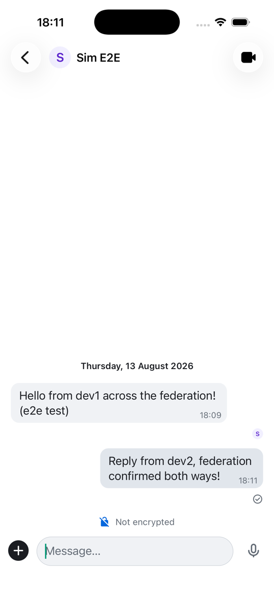

# Federation e2e validation (dev, 2026-08)

End-to-end validation of this PR's decentralized routing on a live two-homeserver dev
federation testbed: the primary dev homeserver (hs1) plus a temporary second full
Synapse + MAS stack (hs2), both admitted to the signed roster.

## Setup under test

- Signed roster v3: hs1 (weight 1) and hs2 (weight 0, policy-only) both ACTIVE,
  admitted through `POST /authority/admission` with Ed25519 key-possession proofs;
  every membership change appended to the transparency log.
- Routing policy `dev-routing` v2, authored offline, delegate-signed per zone, then
  authority-signed server-side via the new `POST /authority/policy/sign` endpoint
  (the authority private key never left the service). Zone `zone-dev2-test`
  (PHONE_PREFIX `+55119888`, delegate-verified) routes new registrations to hs2;
  everything else falls back to hs1 via the weighted fallback rule.
- Policy served from the file source with hot reload: the v1 to v2 swap was picked
  up live inside the refresh interval, no restart.

## What was validated

1. iOS app, fresh phone number outside the test prefix: `/resolve` returned a
   register decision for hs1 via the fallback rule. Full onboarding (OTP, profile,
   PIN, OIDC provisioning) landed the account on hs1.
2. iOS app, fresh phone number inside `+55119888`: `/resolve` returned hs2 via
   `PolicyRoutingRule` (`rule-dev2-prefix`, delegate-verified zone, decision trace
   with policy id, version, and roster version). Same onboarding UX, account landed
   on hs2. The user saw no server anywhere.
3. Federated DM between the two accounts, both directions, verified in-app and via
   the client API on the other side.
4. Beta gate interplay: with the web-signup allowlist enabled, a native registration
   on hs2 was BLOCKED while hs2's MAS ran an older fork image that does not forward
   the downstream-client marker (fail-closed worked as designed), and passed once
   hs2's MAS matched hs1's image. This validated both the gate and the marker path
   live, and caught a real image-tag drift between the deployed MAS and its values
   file.

## Evidence

Account home on hs2 after policy-routed registration; the federated invite arriving
from the hs1 account; the inbound hs1 message rendered on the hs2 account; the reply
delivered back (also confirmed on hs1 via the client API).

| | | | |
|---|---|---|---|
|  |  |  |  |

## Known follow-ups (out of scope for this PR)

- The OIDC onboarding path does not yet publish phone-to-homeserver mappings to the
  resolver directory (identity-service change, tracked separately), so `/resolve`
  for a just-registered phone still returns a register decision; placement stays
  deterministic so the account lands on the same homeserver.
- Cross-homeserver user search by bare handle is local-directory only today; a full
  address resolves and federates. Global handle discovery belongs to the identity
  layer roadmap.
